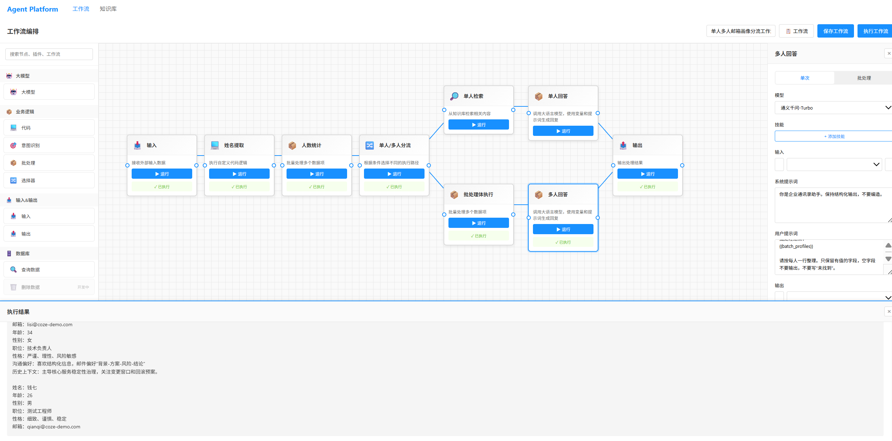

一个轻量版工作流智能体平台，提供：
- 可视化工作流编排
- 知识库管理（文档上传 / 检索）
- 基于通义千问的智能问答

---

## 项目概览

### 技术栈
- 前端：Vue 3 + TypeScript + Vite + Pinia + Vue Router
- 后端：NestJS + TypeORM + PostgreSQL
- AI：通义千问 API

### 核心能力
- 拖拽式工作流画布（节点编排、连线、执行）
- 知识库文档上传、删除、检索
- 多轮会话问答（可关联工作流）
- 工作流执行日志记录

### 当前端口约定
- 前端开发服务：`http://localhost:5173`
- 后端 API 服务：`http://localhost:3001`
- 前端通过 Vite 代理将 `/api` 转发到 `http://localhost:3001`

---

## 目录结构

```text
coze/
├─ backend/                  # NestJS 后端
│  ├─ src/
│  ├─ database/
│  │  ├─ init.sql            # 旧版 MySQL 初始化脚本（历史）
│  │  └─ init_postgres.sql   # 当前 PostgreSQL 初始化脚本
│  └─ .env
├─ frontend/                 # Vue3 前端
│  ├─ src/
│  └─ vite.config.ts
└─ README.md
```

---

## 快速启动（本地开发）

### 1) 前置要求
- Node.js >= 16
- PostgreSQL >= 14（建议 15）
- 可访问通义千问 API（用于大模型节点）

### 2) 创建数据库

先确保 PostgreSQL 服务已启动，然后创建数据库：

```bash
psql -U postgres -h localhost -c "CREATE DATABASE workflow_platform;"
```

如果提示数据库已存在可忽略。

### 3) 初始化表结构

执行项目内 PostgreSQL 初始化脚本：

```bash
psql -U postgres -h localhost -d workflow_platform -f backend/database/init_postgres.sql
```

### 4) 配置后端环境变量

编辑 `backend/.env`：

```env
# 通义千问 API Key
QWEN_API_KEY=你的QWEN_API_KEY

# 服务端口
PORT=3001

# PostgreSQL
DB_HOST=localhost
DB_PORT=5432
DB_USER=postgres
DB_PASSWORD=你的数据库密码
DB_NAME=workflow_platform

# JWT（如需登录鉴权）
JWT_SECRET=coze_dev_secret
```

### 5) 安装依赖

```bash
# 前端
cd frontend
npm install

# 后端
cd ../backend
npm install
```

### 6) 启动服务

分别打开两个终端：

```bash
# 终端 A：启动后端
cd backend
npm run dev
```

```bash
# 终端 B：启动前端
cd frontend
npm run dev
```

### 7) 访问系统

浏览器打开：`http://localhost:5173`

---

## 功能使用

### 工作流编排
1. 从左侧节点面板拖拽节点到画布
2. 拖拽节点输出端到目标节点输入端完成连线
3. 点击节点在右侧编辑配置
4. 点击“保存工作流”持久化，点击“执行工作流”运行

### 知识库管理
1. 进入“知识库”页面
2. 支持文本录入或 `.txt/.md` 文件上传
3. 上传成功后可在列表查看、检索、删除

### 智能问答
1. 创建或选择会话
2. 输入问题发送
3. 系统结合工作流与知识库返回回答

---

## 部署说明（生产）

### 后端构建与启动

```bash
cd backend
npm install
npm run build
npm run start
```

### 前端构建与发布

```bash
cd frontend
npm install
npm run build
```

构建产物位于 `frontend/dist`，可用 Nginx 托管静态资源。

### Nginx 反向代理示例

```nginx
server {
    listen 80;
    server_name your-domain.com;

    root /path/to/frontend/dist;
    index index.html;

    location / {
        try_files $uri $uri/ /index.html;
    }

    location /api/ {
        proxy_pass http://127.0.0.1:3001/api/;
        proxy_http_version 1.1;
        proxy_set_header Host $host;
        proxy_set_header X-Real-IP $remote_addr;
        proxy_set_header X-Forwarded-For $proxy_add_x_forwarded_for;
    }
}
```


## API 前缀

后端统一前缀：`/api`

示例：
- `GET /api/knowledge`
- `POST /api/knowledge/upload`
- `GET /api/workflow`
- `POST /api/workflow/:id/execute`

---

## 界面示例


